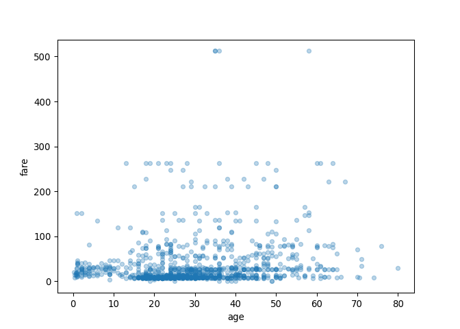
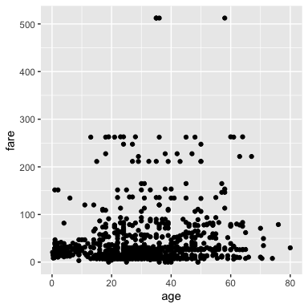

Python in R Markdown
================

-   [Python in `.Rmd` files](#python-in-.rmd-files)
    -   [Load libraries](#load-libraries)
    -   [Load data](#load-data)
    -   [plot data](#plot-data)
    -   [Subsetting data in `pandas`](#subsetting-data-in-pandas)
    -   [And inline python code within markdown
        text!](#and-inline-python-code-within-markdown-text)

To use Python in R Markdown, we need to load the
{[reticulate](https://rstudio.github.io/reticulate/)} R package in a
code chunk, we do it here in the setup code chunk. We also load the
{[ggplot2](https://ggplot2.tidyverse.org/)} R package so we can plot
some data from a Python `pandas` data frame later on!

## Python in `.Rmd` files

### Load libraries

Just like R, you can use Python in `.Rmd` files! Here we import the
Python package that we need to import our data into Python, `pandas`.
`pandas` is a Python package that adds data reading, wrangling, and
simple data visualization functionality to Python. It holds a similar
place as the {tidyverse} R meta-package does (however `pandas` is not a
meta-package, just a very large package). If you want to learn more
about pandas, see the “[10 minutes to
pandas](https://pandas.pydata.org/pandas-docs/stable/user_guide/10min.html)”
in the docs our checkout this free interactive course:
<https://prog-learn.mds.ubc.ca/en>.

``` python
import pandas as pd
```

### Load data

Let’s load the titanic data (which lives in the `data` directory of this
project) and view the data:

``` python
titanic  = pd.read_csv("data/titanic.csv")
```

### plot data

#### Using Python and `pandas`

First, let’s use some quick and simple `pandas` plotting functions:

``` python
titanic.plot.scatter(x='age', y='fare', alpha=0.3)
```



Want to learn more about getting started plotting in Python using
`pandas`, see this page to get started:
<https://pandas.pydata.org/pandas-docs/stable/user_guide/visualization.html>

#### Using R and {ggplot2}

We can also access the Python environment in this R Markdown document
from R! This allows us to apply R’s functions on our Python objects! We
can use the `py$obbject` syntax to do this and create a data
visualization using {ggplot2}!

``` r
ggplot2::ggplot(py$titanic, aes(x = age, y = fare)) +
  geom_point()
```

<!-- -->

### Subsetting data in `pandas`

Here we subset the age and fare columns:

``` python
titanic[["age", "fare"]]
```

    ##           age      fare
    ## 0     29.0000  211.3375
    ## 1      0.9167  151.5500
    ## 2      2.0000  151.5500
    ## 3     30.0000  151.5500
    ## 4     25.0000  151.5500
    ## ...       ...       ...
    ## 1304  14.5000   14.4542
    ## 1305      NaN   14.4542
    ## 1306  26.5000    7.2250
    ## 1307  27.0000    7.2250
    ## 1308  29.0000    7.8750
    ## 
    ## [1309 rows x 2 columns]

Here we filter for rows containing people over 85:

``` python
titanic[titanic["age"] > 70]
```

    ##       pclass  survived  ...   body                home.dest
    ## 9          1         0  ...   22.0      Montevideo, Uruguay
    ## 14         1         1  ...    NaN            Hessle, Yorks
    ## 61         1         1  ...    NaN  Little Onn Hall, Staffs
    ## 135        1         0  ...    NaN             New York, NY
    ## 727        3         0  ...  171.0                      NaN
    ## 1235       3         0  ...    NaN                      NaN
    ## 
    ## [6 rows x 14 columns]

Here we find the destination of the first passenger:

``` python
first_dest = titanic["home.dest"][0]
```

### And inline python code within markdown text!

The destination of the first passenger is St Louis, MO.
